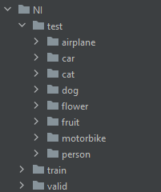

# AlexNet study, training on edge maps

## Context 

This was my last exam project in a the Image Analysis course at Østfold University College. This project received the highest possible grade, A.

## Preparing the python environment
### Create the python environment:

    python3 -m venv <environment_path>

### Installing dependecies
Please activate your environment before doing the next step. The environment activation method is different based on your operating system.

    pip install -r requirements.txt

## Dataset downloads
Natural Images:

https://www.kaggle.com/datasets/prasunroy/natural-images

Daisy vs Dandelion:

https://public.roboflow.com/classification/flowers_classification/2

## Splitting the Natural Images dataset
The NI dataset is distributed without a train, valid, split. This will have to be done manually.

Use the train_valid_split_NI.py as such:

    python train_valid_split_NI.py --root_dir <root_path> --output_dir <output_path>

The `--root_dir` should be the path to the directory containing the class folders.

Example:
    
    python train_valid_split_NI.py --root_dir image_data/original_NI/data --output_dir image_data/NI

## Creating dataset variations
To create new dataset variations use create_dataset_variation.py.

The script is activate as followed:

    python create_dataset_variation.py --method <preprocessing method> --root_dir <root_path> --output_dir <output_path>

`--root_dir` should be the path to train, valid, test split dataset. This directory should have the following structure:

`--output_dir` the path were the dataset variation should be placed.

`--method` the preprocess method which should be applied to this dataset variation.

- resize
- canny
- roberts
- sobel
- laplacian
- morphgrad

Dataset images when initially downloaded are not of the AlexNet input size 224x224. Please, use edge detection methods(not resize) on a resized dataset if you are planing to train a model on edge maps.

Example, creating resize variation:

    python create_dataset_variation.py --method resize --root_dir image_data/NI --output_dir image_data/NI_resized

Example, creating Sobel variation:

    python create_dataset_variation.py --method sobel --root_dir image_data/NI_resized --output_dir image_data/NI_sobel

## Training and Testing
For training and testing a model please use main.py.

Parameters:

* `--name` The name of the model. A folder containing the best validation score weights and logging of loss and validation accuracy. This folder will share this name.
* `--mode` What the program will do. Can be either train or test. train for training a new model. test for testing pretrained model. 
* `--dataset` What dataset we are using. Can be either NI or DD. Decides the number of output neurons of the AlexNet. Creates 8 if NN and 2 if DD. These are the number of classes for each dataset. This parameter frames number of classes into to 2 options.
* `--train_folder` Path to training folder. The training folder should only contain class folders filled with images of that class.
* `--valid_folder` Path to validation folder. The validation folder should only contain class folders filled with images of that class.
* `--test_folder` Path to validation folder. The validation folder should only contain class folders filled with images of that class.
* `--batch_size` Number of samples per batch. Default: 32
* `--num_workers` Number of workers used for loading samples. Default: 10
* `--lr` Learning rate. Default: 0.0001. 0.0001 is a good learning rate for training on above datasets.
* `--epochs` Number of epochs to train for: Default: 30
* `--pretrained_weights` path to pretrained AlexNet weights. Only used in testing mode.

If you are interested in the exact project results, use default values for `--batch_size`, `--num_workers` and `--lr`

Example, training a regular images model:

    python main.py --name NI_resized_model --mode train --dataset NI --train_folder image_data/NI_resized/train --valid_folder image_data/NI_resized/valid --test_folder image_data/NI_resized/test

    
Example, training an edge maps model:
    
    python main.py --name NI_sobel_model --mode train --dataset NI --train_folder image_data/NI_sobel/train --valid_folder image_data/NI_sobel/valid --test_folder image_data/NI_sobel/test

In training mode training statistics, loss and validation accuracy will be logged to the `--name` folder. The best weights during the training will also be saved to this folder as "epoch[best_validation_epoch].pt".

When all epochs are completed, the highest validation score weights test accuracy will also be printed.

Example, testing a model:

    python main.py --mode test --dataset NI --pretrained_weights models/NI_resized_model/epoch27.pt --test_folder image_data/NI_resized/test
